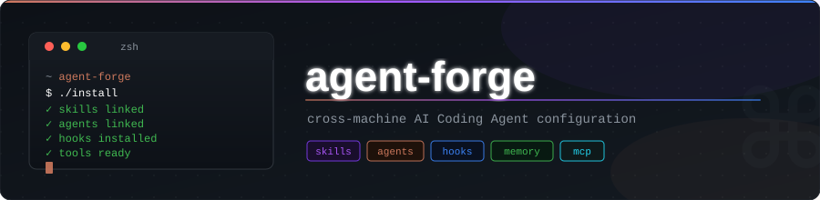

<div align="center">
  

  <br/>

  [](LICENSE)
  [](AGENTS.md)
  [](install)
  [](https://github.com/jamescodesthings/claude-config/commits/main)
</div>

---

# Agent Forge

**Agent Forge** is a unified multi-agent CLI orchestration framework and shared configuration manager. It standardizes system prompts, skills, memory, agents, lifecycle hooks, and shell aliases across **Claude Code**, **Antigravity CLI**, **OpenAI Codex**, and **GitHub Copilot**.

---

## Supported Agent CLIs

| Agent CLI | Launch Command | Shell Alias | Config Location | System Prompt |
|-----------|----------------|-------------|-----------------|---------------|
| **Claude Code** | `claude` | `cld` (`cldr` resume) | `~/.claude/` | `claude/config/CLAUDE.md` |
| **Antigravity** | `agy` | `aggy` (`aggyr` continue) | `~/.gemini/` | `antigravity/config/GEMINI.md` |
| **OpenAI Codex** | `codex` | `chat` (`chatr` resume) | `~/.codex/` | `codex/` |
| **GitHub Copilot** | `copilot` | `pilot` (`pilotr` continue) | `~/.copilot/` | `copilot/` |

---

## Quick Start & Makefile Commands

### Installation

```shell
git clone git@github.com:jamescodesthings/claude-config.git agent-forge
cd agent-forge
make install            # Install all CLI configurations
```

Additional Makefile targets:
- `make claude`: Install Claude Code CLI configuration only.
- `make antigravity`: Install Antigravity CLI configuration only.
- `make uninstall`: Uninstall all CLI configurations.
- `make uninstall-claude`: Uninstall Claude Code CLI configuration.
- `make uninstall-antigravity`: Uninstall Antigravity CLI configuration.

`make install` creates required target directories, processes declarative `manifest.txt` files, decrypts WIP skills, installs tool plugins, configures RTK, and adds shell alias sourcing (`AI_CONFIG_DIR`) to `~/.zshrc`.

### Syncing Updates

```shell
git pull && make install
```

---

## How Do I Actually Use This

### ...create a new project?

Point a fresh Claude Code session at [`PROJECT_INIT.md`](PROJECT_INIT.md): *"init this project from `~/projects/personal/agent-forge/PROJECT_INIT.md`"*. Seeds the project's `CLAUDE.md`/`AGENTS.md` with agent-forge's shared rules plus the project-specific structure (stack, testing, post-implementation checks), and seeds its memory directory.

### ...sync an existing project's instructions after agent-forge's rules change?

Same file, same prompt, different starting state: *"update project instructions from `~/projects/personal/agent-forge/PROJECT_INIT.md`"*. It diffs the project's current `CLAUDE.md` against agent-forge's canonical rules, uses [`PROJECT_INIT_CHANGELOG.md`](PROJECT_INIT_CHANGELOG.md) to tell "just stale" from "no idea," leaves project-specific overrides alone, and asks you about anything genuinely ambiguous instead of guessing.

### ...manage WIP skills and memories?

The `skill-*`/`memory-*` command family (on `$PATH` after `make install` — tab-complete `skill` or `memory` to see all six):

| Verb | Does |
|------|------|
| `skill-new` / `memory-new` | Scaffold a new one, fuzzed name, encrypted immediately |
| `skill-encrypt` / `memory-encrypt` | Re-sync ciphertext from your local WIP edits |
| `skill-decrypt` / `memory-decrypt` | Force-resync one item from committed ciphertext (backs up your local copy first, timestamped, never silently overwritten) |
| `skill-demote` / `memory-demote` | Pull a public one back into the encrypted WIP tier |
| `skill-graduate` / `memory-graduate` | Promote a WIP one to public, plaintext, committed — **you run this yourself, always.** The assistant never does |
| `skill-remove` / `memory-remove` | Delete outright, from wherever it currently lives |

---

## Shell Aliases (`zsh/aliases.zsh`)

| Alias | Command | Purpose |
|-------|---------|---------|
| `cld` | `claude --dangerously-skip-permissions` | Launch Claude Code CLI |
| `cldr` | `claude --resume --dangerously-skip-permissions` | Resume last Claude session |
| `aggy` | `agy --dangerously-skip-permissions` | Launch Antigravity CLI |
| `aggyr` | `aggy --continue` | Continue last Antigravity session |
| `chat` | `codex --dangerously-bypass-approvals-and-sandbox` | Launch Codex CLI |
| `chatr` | `codex resume --last ...` | Resume last Codex session |
| `pilot` | `copilot --allow-all` | Launch Copilot CLI |
| `pilotr` | `copilot --continue --allow-all` | Continue Copilot session |
| `cldm` | `claude-monitor` | Session token & cost monitor |

---

## Architecture & Workflows

### Model Selection Guidelines

- **Default Model (`gemini-3.6-flash` / Sonnet):** Standard coding, subagents, code review, and implementation.
- **Pro Model (`gemini-3.1-pro` / Opus):** Complex multi-step reasoning, architecture decisions, novel debugging, and large refactors.
- **Flash-Lite Model (`gemini-3.6-flash-lite` / Haiku):** Triage, file validation, routing, simple classification, and quick research.

### Session State & Handoff System

Agent Forge includes an automated session state tracking protocol stored in [`.state/CURRENT_STATE.md`](file:///Users/jamesmacmillan/projects/personal/agent-forge/.state/CURRENT_STATE.md):
- **Session Startup:** Incoming agents inspect `.state/CURRENT_STATE.md` to restore task context.
- **Session Handoff:** Agents record progress and save timestamped snapshots to `.state/YYYY-MM-DD-HH-MM-<tool>.md`.

See [AGENTS.md](AGENTS.md) and [shared/system-prompt/workflow.md](shared/system-prompt/workflow.md) for full details.
