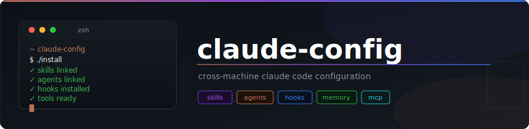

<div align="center">
  

  <br/>

  [](LICENSE)
  [](https://claude.ai/code)
  [](install)
  [](https://github.com/jamescodesthings/claude-config/commits/main)
  [](https://github.com/jamescodesthings/claude-config)
</div>

---

Cross-box shared Claude Code configuration — skills, agents, hooks, and tool installers.

## Requirements

- `zsh` (Ubuntu: `sudo apt-get install zsh`)
- `node` / `npx` / `npm`
- `curl`

## Install

```shell
git clone git@github.com:jamescodesthings/claude-config.git
cd claude-config
./install
```

## Sync after git pull

```shell
git pull && ./install
```

## Uninstall

```shell
./uninstall
```

## How it works

`config/` files are symlinked to `~/.claude/`. `hooks/` are symlinked individually into `~/.claude/hooks/`. `tools/install-*` scripts install external tools. `legacy/uninstall-*` cleans up deprecated tools on re-install. See CLAUDE.md for the full reference.

## Starting a new project

On first use in a new project Claude will create a `CLAUDE.md` with the right structure; stack, setup, test commands, and the `## Post-implementation checks` hook for post-implementation review.
